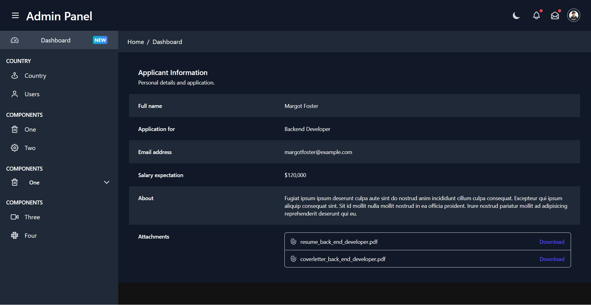
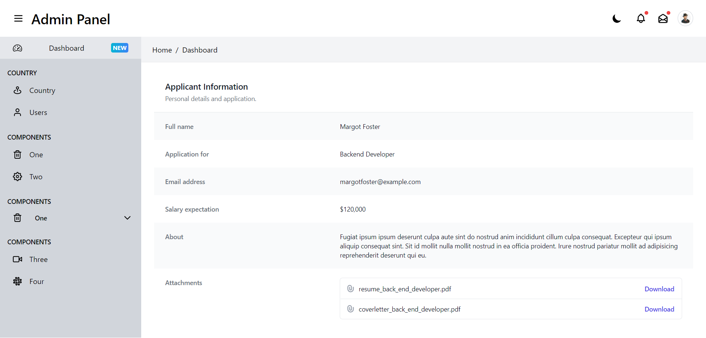

# Admin Panel

Created with React Js + Tailwind CSS

Hi, this project is still in progress. I just begin my journey with Tailwind CSS, so I want to make something beautiful and useful. Let's learn together!

[View the demo 🚀](https://admin-panel-reactjs-tailwindcss.vercel.app/)

## How to install
1. Clone or download this repository
2. Enter to `admin-panel-reactjs-tailwindcss` directory (with Terminal/CMD)
3. Run: `npm install`
4. Run: `npm run dev` for development, then open your favorite browser and go to address `localhost:3000`
5. Run: `npm run build` for production
6. Make your own changes and happy coding!

## Screenshots

Here is some screenshots. And please note, because this project is still in progress, you can found the latest update on [demo page](https://admin-panel-reactjs-tailwindcss.vercel.app/).

Hope you love it!

Powered by https://fb.com/habibur.rahman.sobuj.bd